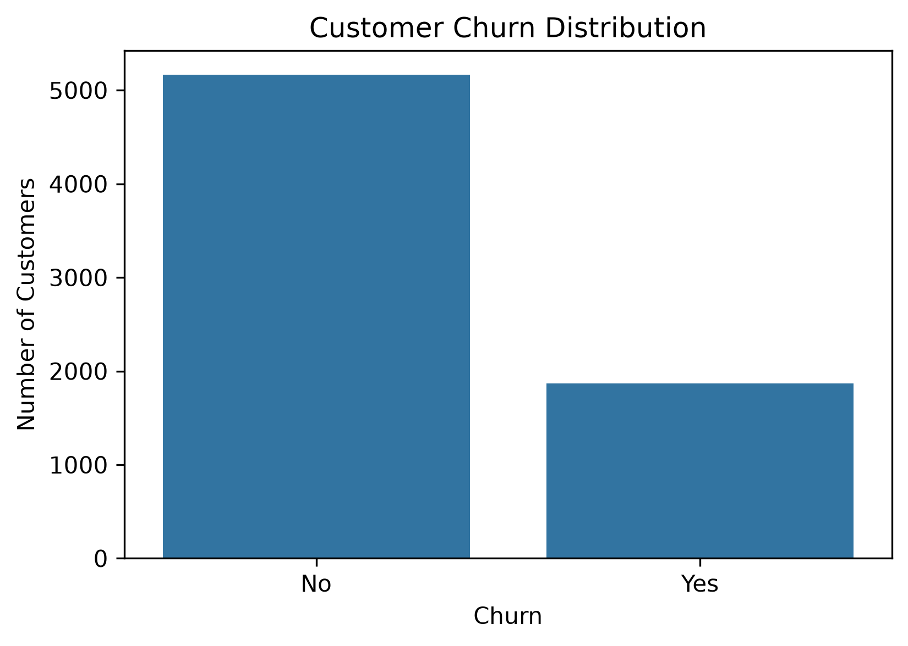
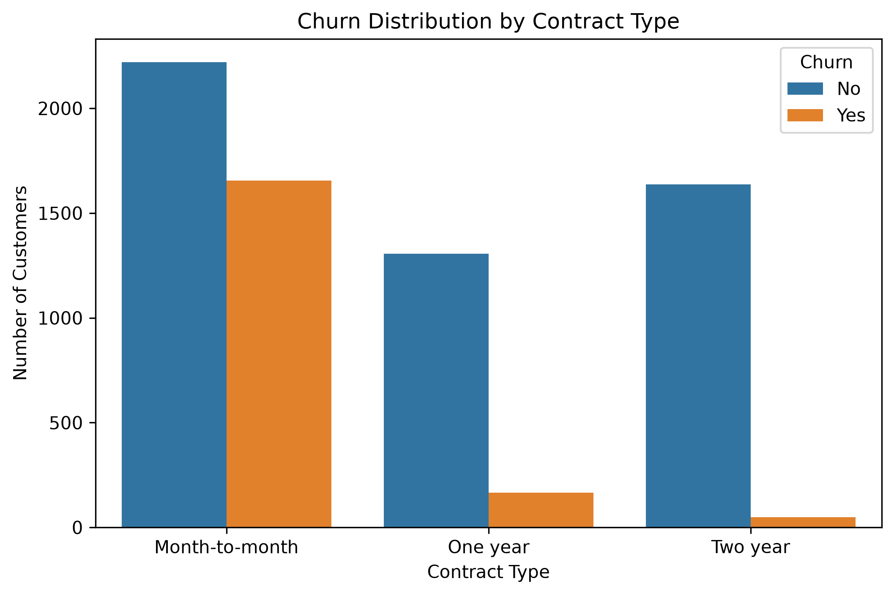

# Customer Churn Prediction

A machine learning project for predicting customer churn using the Telco Customer Churn dataset.

The goal of this project is to analyze customer behavior, identify factors associated with customer churn, and develop classification models capable of predicting customers who are likely to leave a subscription service.

---

## Project Overview

Customer churn prediction is an important problem for subscription-based businesses because retaining existing customers can be more cost-effective than acquiring new ones.

This project follows a complete machine learning workflow:

- Data loading and exploration
- Data cleaning and preprocessing
- Exploratory data analysis (EDA)
- Feature engineering
- Machine learning model development
- Model comparison and evaluation
- Feature importance analysis
- Saving trained models and evaluation reports

---

## Dataset

The project uses the **Telco Customer Churn Dataset**, which contains information about 7,043 customers.

The dataset includes:

- Customer demographics
- Account information
- Service subscriptions
- Payment methods
- Monthly and total charges
- Customer churn status

Target variable:

```
Churn
```

where:

- `No` → Customer stayed
- `Yes` → Customer left the service

---

## Data Preprocessing

The following preprocessing steps were applied:

- Removed missing values caused by empty `TotalCharges` entries
- Converted `TotalCharges` from object type to numeric format
- Removed `customerID` because it does not provide predictive information
- Applied one-hot encoding to categorical variables
- Split the dataset into training and testing sets

Final processed dataset:

- Samples: 7,032
- Features after encoding: 30

Train-test split:

- Training set: 5,625 samples
- Test set: 1,407 samples

---

## Exploratory Data Analysis

The exploratory analysis investigated relationships between customer characteristics and churn behavior.

Key observations:

- Overall churn distribution:

  - No churn: 73.46%
  - Churn: 26.54%

- Customers with shorter tenure showed higher churn rates.
- Month-to-month contracts were associated with higher churn compared with longer-term contracts.
- Fiber optic internet customers showed higher churn proportions.
- Billing-related features such as monthly charges and total charges showed strong relationships with churn behavior.

---

## Visual Analysis

The project includes visual analysis of important churn patterns.

Generated visualizations include:

- Overall churn distribution
- Churn by contract type
- Churn by internet service
- Churn by payment method
- Relationship between tenure and churn
- Monthly charges analysis
- Total charges analysis

All generated figures are stored in the `figures/` directory.

Examples:





---

## Machine Learning Models

Four classification models were trained and evaluated:

1. Logistic Regression
2. Logistic Regression with class balancing
3. Random Forest
4. Gradient Boosting

Evaluation metrics:

- Accuracy
- Precision
- Recall
- F1-score
- Confusion Matrix

---

## Model Results

| Model | Accuracy | Churn Recall | Churn F1-score |
|---|---:|---:|---:|
| Logistic Regression | 0.8038 | 0.5722 | 0.6080 |
| Logistic Regression Balanced | 0.7264 | 0.7968 | 0.6075 |
| Random Forest | 0.7719 | 0.6604 | 0.6061 |
| Gradient Boosting | 0.7960 | 0.5294 | 0.5798 |

The models demonstrate different trade-offs between overall accuracy and detecting churn cases.

For churn prediction tasks, recall is an important metric because correctly identifying potential churn customers can help businesses take preventive actions.

---

## Feature Importance

Feature importance analysis was performed using the Gradient Boosting model.

Top influential features:

| Feature | Importance |
|---|---:|
| TotalCharges | 0.1759 |
| tenure | 0.1648 |
| MonthlyCharges | 0.1524 |
| Contract (Two year) | 0.0617 |
| InternetService (Fiber optic) | 0.0392 |
| PaymentMethod (Electronic check) | 0.0377 |

The results indicate that customer loyalty duration, billing information, and contract type are important factors in churn prediction.

---

## Saved Model

The trained Gradient Boosting model was saved using Joblib:

```
models/
└── gradient_boosting_churn_model.pkl
```

The saved model can be loaded for future predictions and deployment experiments.

---

## Project Structure

```
customer-churn-prediction/

├── data/
│   ├── raw/
│   └── processed/

├── figures/
│   ├── churn_distribution.png
│   ├── contract_vs_churn.png
│   ├── internet_service_vs_churn.png
│   ├── monthly_charges_vs_churn.png
│   ├── payment_method_vs_churn.png
│   ├── tenure_vs_churn.png
│   └── total_charges_vs_churn.png

├── models/
│   └── gradient_boosting_churn_model.pkl

├── notebooks/
│   ├── 03_data_exploration_new.ipynb
│   ├── 04_model_training_new.ipynb
│   └── 05_visualization.ipynb

├── reports/
│   ├── model_comparison.csv
│   └── feature_importance.csv

├── src/
├── tests/
├── docs/
└── README.md
```

---

## How to Run

Clone the repository:

```bash
git clone https://github.com/AnaAlh/customer-churn-prediction.git
```

Create and activate a virtual environment:

```bash
python -m venv .venv
```

Install dependencies:

```bash
pip install -r requirements.txt
```

Run notebooks in order:

1. `03_data_exploration_new.ipynb`
2. `04_model_training_new.ipynb`
3. `05_visualization.ipynb`

---

## Technologies Used

- Python
- Pandas
- NumPy
- Scikit-learn
- Matplotlib
- Seaborn
- Jupyter Notebook
- Git & GitHub

---

## Future Improvements

Possible future improvements:

- Hyperparameter optimization
- Cross-validation
- Additional ensemble models
- Model explainability using SHAP
- Deployment as a prediction API

---

## Author

Anahita Alhouei

Machine Learning / Artificial Intelligence Project